# Resultados dos Testes — InformationTheory

Esta página reúne os resultados obtidos pela suíte de testes do projeto. Cada seção apresenta, de forma breve, **o que o teste mede** e **a visualização produzida**. Os dados brutos estão disponíveis em `results.csv` no diretório correspondente.

---

## 1. Compressibility — taxa de compressão

Mede a **razão entre o tamanho comprimido e o original** para cada arquivo de referência, sob cada algoritmo. Valores próximos de `0` indicam alta compressão; valores próximos ou acima de `1` indicam baixa compressão ou **expansão** (típica em arquivos muito pequenos, onde o cabeçalho do formato supera o ganho).

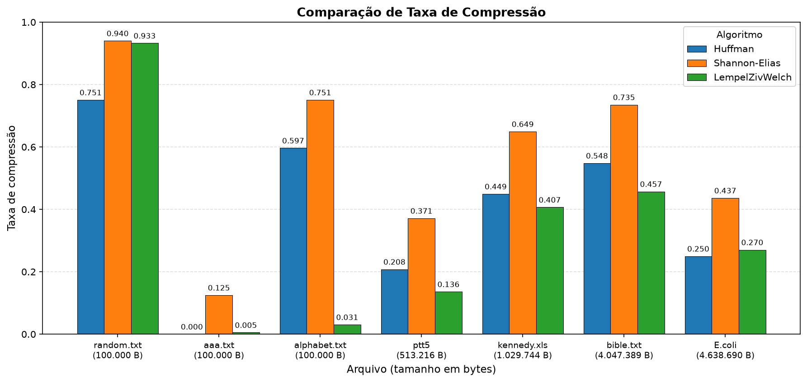

---

## 2. MaxCompressibility — compressão iterativa

Investiga **até que ponto a recompressão ainda vale a pena**. Cada algoritmo é aplicado **cinco vezes consecutivas** sobre o mesmo arquivo, alimentando a saída de uma execução como entrada da próxima. O gráfico mostra a evolução do tamanho ao longo das iterações: curvas decrescentes indicam redundância ainda a explorar; curvas crescentes indicam que a recompressão passou a **introduzir overhead** (cabeçalhos adicionais) sem ganho real.

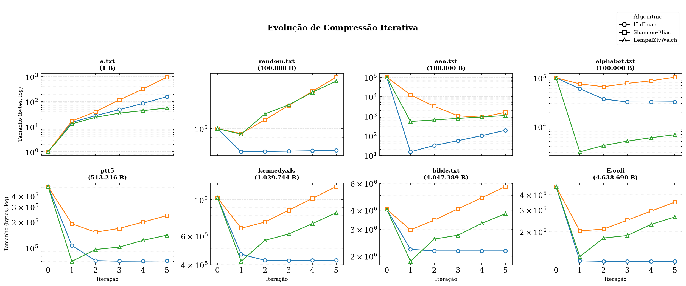

---

## 3. TimeDuration — tempo de compressão e descompressão

Mede o **tempo médio de compressão e descompressão** de cada algoritmo sobre cada arquivo. Cada operação é executada cinco vezes, e a média é registrada para reduzir ruído. As barras sólidas representam **compressão**; as hachuradas, **descompressão**. O eixo Y está em **escala logarítmica** — os tempos variam de milissegundos a dezenas de segundos conforme o arquivo.

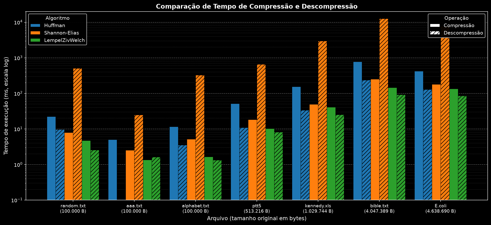

---

## 4. MemoryUsage — perfil de memória

Mede o **consumo de memória** (heap e stack) durante compressão e descompressão, via **Valgrind Massif**. Para cada arquivo, é gerada uma figura com **seis painéis**:

- **Linha superior** — compressão (Huffman, Shannon-Elias, LZW).
- **Linha inferior** — descompressão (mesma ordem).
- **Curva azul** — heap; **curva laranja** — stack.
- **Eixo X** — tempo sob Valgrind (escala log); **eixo Y** — bytes (escala log).

### a.txt (1 B)
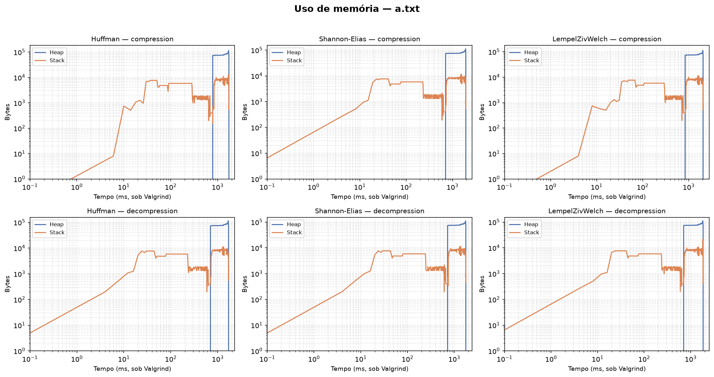

### random.txt (100.000 B)
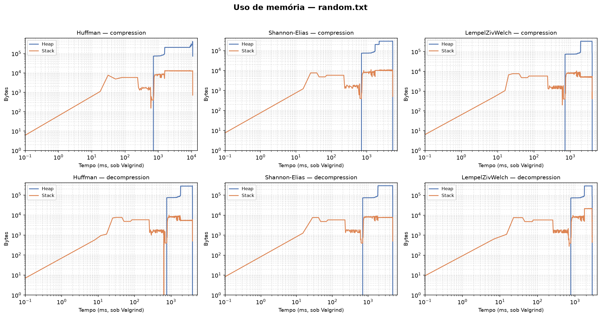

### aaa.txt (100.000 B)
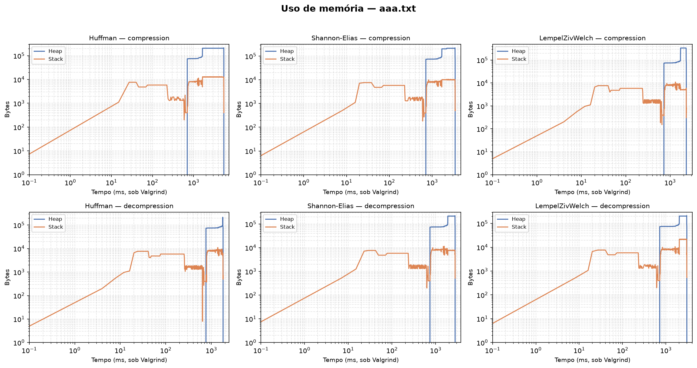

### alphabet.txt (100.000 B)
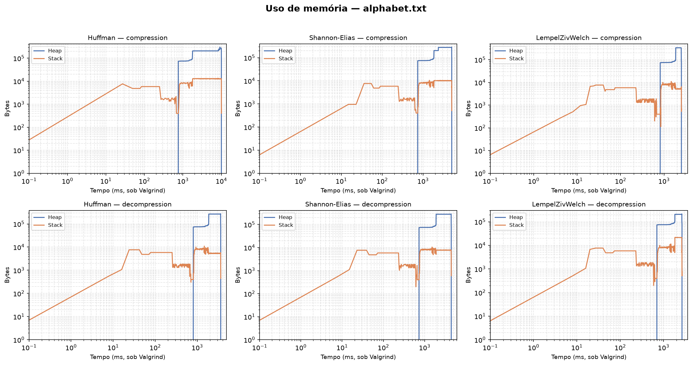

### ptt5 (513.216 B)
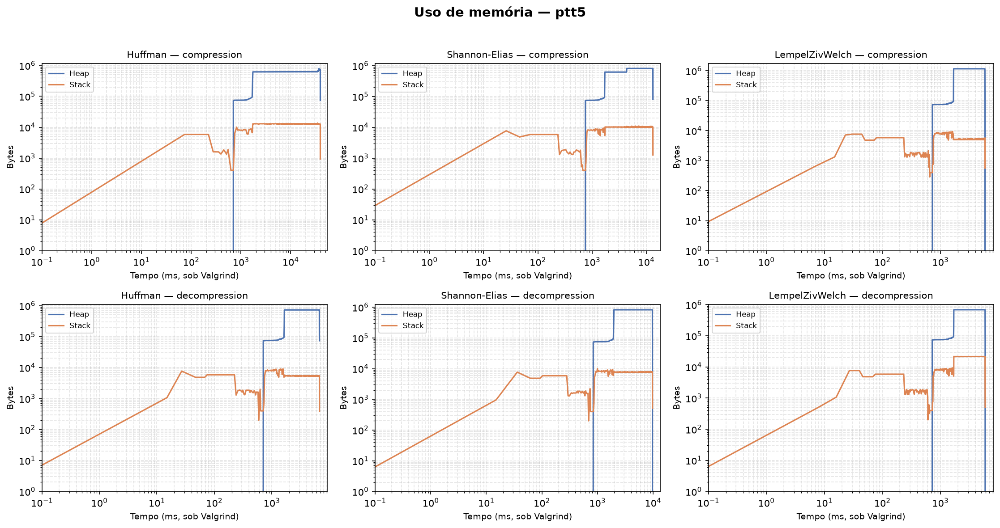

### kennedy.xls (1.029.744 B)
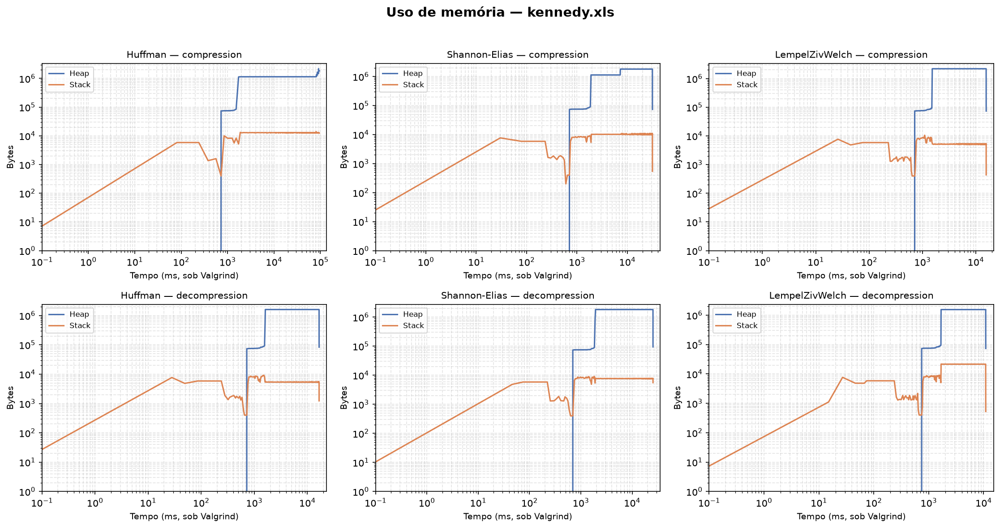

### bible.txt (4.047.389 B)
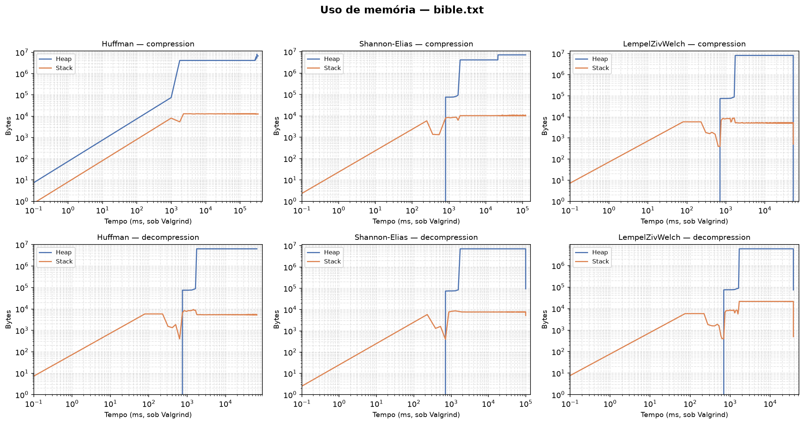

### E.coli (4.638.690 B)
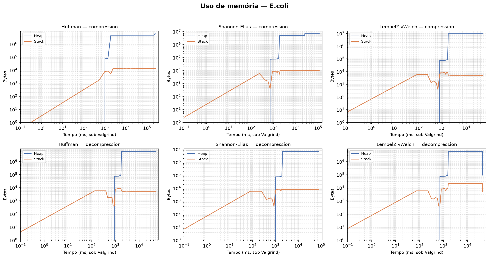

---

## Como reproduzir

Os testes são disparados via Makefile, a partir da raiz do projeto:

```bash
make deep_test N=0    # Compressibility
make deep_test N=1    # MaxCompressibility
make deep_test N=2    # TimeDuration
make deep_test N=3    # MemoryUsage
```

> O teste de memória exige o **Valgrind** instalado e o binário compilado com `make debug`.